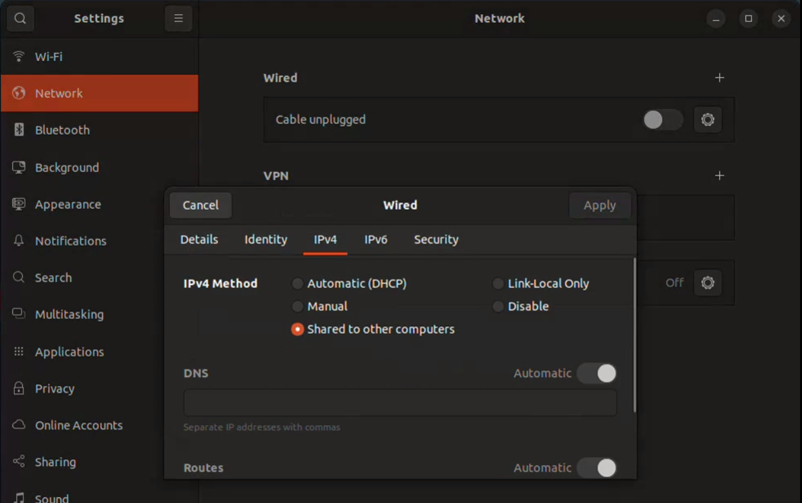

# Setting up Mirte
 
## Connecting to the robot with ethernet
If you connect it to your laptop, you'll need to change one setting to have your laptop give your robot an IP address. Go to settings, Network, Wired settings, IPv4, click on "Shared to other computers". See the attachment for the button. You might need to unplug and plug it back in after changing the settings.
  



The robot will probably get an IP in the 10.42.0.xx range. This should be visible on the screen or you can use AngryIpScanner to find it. The laptop with the ethernet cable can use that IP for SSH and ROS.
 
Don't forget to change the setting back to Automatic when you want to connect to a normal network.
 
## Logging in
When trying to ssh into the robot, use ssh mirte@your_mirtes_ip_address. This requires the 'standard' password mirte_mirte the first time you do this, or your own password the next time. Run ssh-copy-id mirte@ip to never again having to enter the password again.
 
You can use the VSCode remote ssh plugin to edit the files and open multiple terminals.

## Trying things with Mirte

You can use a terminal ssh-ed into Mirte to inspect and interact with the ROS2 nodes running. Please try the following exercises:

1. List all of the topics on Mirte
```bash
ros2 topic list
```
This show all the ROS2 topics some node is either subscribing or publishing to.

2. Inspect a specific topic
```bash
ros2 topic info /scan
```

3. You can even check how frequently a topic is being published
```bash
ros2 topic hz /scan
```

4. Or how much bandwidth it is using. Try this with one of the camera messages
```bash
ros2 topic bw <topic_name>
```

## Day one patch


### Making sure you have internet
There are extra configurations for the 2025 summer school, however for the setup an internet connection on the robot is required.

After the setup described earlier the robot might have internet, which can be checked by running `ping google.com`. 


If you **do not** receive a response, a temporary internet bridge between your WiFi and ethernet cable to the robot can be configured.
The steps to set this up are as follows:
Run these commands **on your laptop**, **not** on Mirte.
1. Run this command 
```bash
ip a
```

2. There should be a ethernet adapter (starting with `en`), save the name (the part before the colon) to a variable running by running
```bash
ethernet=<ETHERNET_ADAPTER_TO_MIRTE>
```
2. There should also be a wifi (wlan) adapter (starting with `wl`), save this name to the variable running 
```bash
wifi=<OTHER_INTERNET_CONNECTION>
```

Please of course replace the parts between < > with your computer specific details.
3. Then run the following commands:
```bash
sudo iptables -A FORWARD -i $ethernet -o $wifi -j ACCEPT
sudo iptables -A FORWARD -i $wifi -o $ethernet -m state --state ESTABLISHED,RELATED -j ACCEPT
sudo iptables -t nat -A POSTROUTING -o $wifi -j MASQUERADE
```


### The patch


Afterwards you can ssh into the MIRTE and execute the `install_mirte.sh` script on it by excuting the following command 
```bash
`curl --proto '=https' --tlsv1.2 -sSf https://raw.githubusercontent.com/SuperJappie08/mirte-demo-ensurance/refs/heads/development-detection/install_mirte.sh | bash`
```